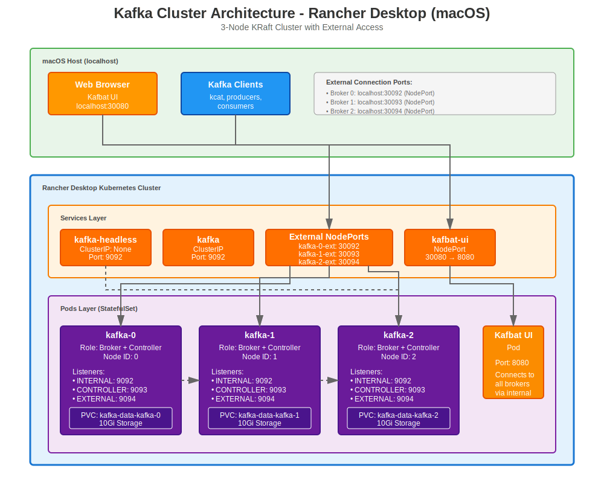

# Multi-Node Kafka Cluster on Rancher Desktop (macOS)

This repository contains Kubernetes manifests for deploying a 3-node Apache Kafka cluster using KRaft mode (no ZooKeeper required) on Rancher Desktop for macOS. The setup includes Kafbat UI for cluster management and monitoring.

## Architecture Overview



- **3 Kafka brokers** running in KRaft mode (combined broker + controller)
- **Persistent storage** via StatefulSet with 10Gi per broker
- **Internal communication** via headless service within the cluster
- **External access** via NodePort services (localhost:30092-30094)
- **Kafbat UI** for web-based cluster management (localhost:30080)

## Prerequisites

- **Rancher Desktop** installed and running on macOS
- Kubernetes enabled in Rancher Desktop
- `kubectl` configured to connect to Rancher Desktop cluster
- At least 6GB of RAM allocated to Rancher Desktop (2GB per broker recommended)

## File Structure and Descriptions

### 01-kafka-headless-service.yaml

**Purpose:** Creates a headless service for internal broker-to-broker communication within the Kubernetes cluster.

**Key Settings:**

- `clusterIP: None` - Makes this a headless service, enabling direct pod-to-pod DNS resolution
- `publishNotReadyAddresses: true` - Allows brokers to discover each other even before they're fully ready
- `service.alpha.kubernetes.io/tolerate-unready-endpoints: "true"` - Ensures brokers can form a quorum during initial startup
- **Port 9092** - Internal Kafka protocol communication

**Why it's needed:** Each Kafka broker needs a stable DNS name (e.g., `kafka-0.kafka-headless.default.svc.cluster.local`) for the controller quorum and inter-broker communication.

---

### 02-kafka-service.yaml

**Purpose:** Provides a standard ClusterIP service for internal cluster access to Kafka.

**Key Settings:**

- `type: ClusterIP` - Only accessible within the Kubernetes cluster
- **Port 9092** - Standard Kafka protocol port

**Why it's needed:** Allows applications running inside the cluster to connect to Kafka using a single service endpoint (`kafka.default.svc.cluster.local:9092`) without needing to know individual broker addresses.

---

### 03-kafka-stateful-set-cluster.yaml

**Purpose:** Defines the core Kafka StatefulSet that manages the 3 broker pods with persistent storage.

**Key Settings:**

#### StatefulSet Configuration

- `replicas: 3` - Runs 3 Kafka brokers for high availability
- `serviceName: kafka-headless` - Links to the headless service for stable networking
- `podManagementPolicy: Parallel` - Starts all pods simultaneously (faster initial deployment)

#### Container Configuration

- **Image:** `apache/kafka:3.8.1` - Official Apache Kafka image with KRaft support
- **Ports:**
  - `9092` - Internal broker communication (INTERNAL listener)
  - `9093` - Controller communication for KRaft consensus (CONTROLLER listener)
  - `9094` - External access from macOS host (EXTERNAL listener)

#### Environment Variables

**Cluster Identity:**

- `CLUSTER_ID: "MkU3OEVBNTcwNTJENDM2Qk"` - Unique cluster identifier for KRaft mode (must be consistent across all brokers)

**KRaft Mode:**

- `KAFKA_PROCESS_ROLES: "broker,controller"` - Each node acts as both broker and controller (no separate ZooKeeper)
- `KAFKA_CONTROLLER_QUORUM_VOTERS` - Defines the 3-node controller quorum for consensus:
  ```
  0@kafka-0.kafka-headless.default.svc.cluster.local:9093
  1@kafka-1.kafka-headless.default.svc.cluster.local:9093
  2@kafka-2.kafka-headless.default.svc.cluster.local:9093
  ```

**Listeners:**

- `KAFKA_LISTENERS` - Binds to three separate ports:
  - `INTERNAL://:9092` - For inter-broker and in-cluster client connections
  - `CONTROLLER://:9093` - For KRaft controller protocol
  - `EXTERNAL://:9094` - For external connections from macOS host
- `KAFKA_ADVERTISED_LISTENERS` - Dynamically set in startup script to advertise correct addresses
- `KAFKA_INTER_BROKER_LISTENER_NAME: "INTERNAL"` - Brokers communicate via INTERNAL listener

**Replication Settings:**

- `KAFKA_DEFAULT_REPLICATION_FACTOR: "3"` - New topics default to 3 replicas
- `KAFKA_MIN_INSYNC_REPLICAS: "2"` - Requires 2 replicas to acknowledge writes (ensures durability)
- `KAFKA_OFFSETS_TOPIC_REPLICATION_FACTOR: "3"` - Consumer offset topic has 3 replicas
- `KAFKA_TRANSACTION_STATE_LOG_REPLICATION_FACTOR: "3"` - Transaction log has 3 replicas
- `KAFKA_TRANSACTION_STATE_LOG_MIN_ISR: "2"` - Transaction log requires 2 in-sync replicas

**Performance & Reliability:**

- `KAFKA_INITIAL_BROKER_REGISTRATION_TIMEOUT_MS: "180000"` - 3-minute timeout for initial registration (generous for slow startups)
- **Resources:**
  - Requests: 500m CPU, 1Gi memory
  - Limits: 1000m CPU, 2Gi memory

#### Dynamic Startup Script

The startup command does several critical tasks:

```bash
export KAFKA_NODE_ID=${POD_NAME##*-}  # Extracts node ID from pod name (kafka-0 → 0)
export EXTERNAL_PORT=$((30092 + KAFKA_NODE_ID))  # Calculates NodePort (30092, 30093, 30094)
export KAFKA_ADVERTISED_LISTENERS="INTERNAL://${POD_NAME}.kafka-headless...:9092,EXTERNAL://localhost:${EXTERNAL_PORT}"
```

This ensures each broker advertises the correct `localhost` port for external access from macOS.

#### Health Checks

- **Liveness Probe:** TCP check on port 9092, waits 60s before starting, allows 6 failures
- **Readiness Probe:** TCP check on port 9092, waits 45s before starting, allows 12 failures (more lenient for cluster formation)

#### Persistent Storage

- **10Gi per broker** - PersistentVolumeClaim for each pod
- `ReadWriteOnce` access mode
- Data stored at `/var/lib/kafka/data`

---

### 04-kafka-external-services.yaml

**Purpose:** Creates individual NodePort services for each Kafka broker, enabling external access from the macOS host.

**Key Settings:**

Each service:

- Uses `statefulset.kubernetes.io/pod-name` selector to target a specific broker pod
- Exposes port `9094` (EXTERNAL listener) on a unique NodePort
- **kafka-0-external:** localhost:30092
- **kafka-1-external:** localhost:30093
- **kafka-2-external:** localhost:30094

**Why it's needed:** Allows Kafka clients running on your Mac (outside Kubernetes) to connect directly to individual brokers. This is essential for producers and consumers that need to connect to specific partition leaders.

**Connection String for macOS clients:**

```
localhost:30092,localhost:30093,localhost:30094
```

---

### 05-kafkabat-ui.yaml

**Purpose:** Deploys Kafbat UI (formerly known as kafka-ui), a web-based interface for managing and monitoring the Kafka cluster.

**Key Components:**

#### ConfigMap (`kafbat-ui-config`)

Defines the UI configuration:

- **Cluster Name:** `local-kafka`
- **Bootstrap Servers:** Connects to all 3 brokers via internal headless service
- **Security:** PLAINTEXT (no authentication)
- **Auth:** Disabled for local development
- **JMX Metrics:** Configured on port 9997 (though not currently exposed in broker config)

#### Deployment

- **Image:** `ghcr.io/kafbat/kafka-ui:latest`
- **Port 8080:** HTTP web interface
- **Environment Variables:**
  - `DYNAMIC_CONFIG_ENABLED: "true"` - Allows runtime configuration changes
  - Config file mounted from ConfigMap
- **Resources:**
  - Requests: 250m CPU, 512Mi memory
  - Limits: 500m CPU, 1Gi memory
- **Health Checks:** Spring Boot actuator endpoints

#### Service

- **Type:** NodePort
- **NodePort 30080:** Access UI at http://localhost:30080
- Maps to container port 8080

**Features Available:**

- View topics, partitions, and consumer groups
- Browse messages
- Create/delete topics
- Monitor cluster health
- View broker configurations

---

## Deployment Instructions

### 1. Deploy in Order

Apply the manifests in numerical order:

```bash
kubectl apply -f 01-kafka-headless-service.yaml
kubectl apply -f 02-kafka-service.yaml
kubectl apply -f 03-kafka-stateful-set-cluster.yaml
kubectl apply -f 04-kafka-external-services.yaml
kubectl apply -f 05-kafkabat-ui.yaml
```

Or deploy all at once:

```bash
kubectl apply -f .
```

### 2. Monitor Deployment

Check pod status (wait for all 3 brokers to be Running and Ready):

```bash
kubectl get pods -l app=kafka -w
```

Expected output after ~2-3 minutes:

```
NAME      READY   STATUS    RESTARTS   AGE
kafka-0   1/1     Running   0          2m
kafka-1   1/1     Running   0          2m
kafka-2   1/1     Running   0          2m
```

Check logs for any broker:

```bash
kubectl logs kafka-0 -f
```

### 3. Verify Services

```bash
kubectl get svc
```

Expected services:

```
NAME                 TYPE        CLUSTER-IP      EXTERNAL-IP   PORT(S)          AGE
kafka                ClusterIP   10.43.x.x       <none>        9092/TCP         3m
kafka-headless       ClusterIP   None            <none>        9092/TCP         3m
kafka-0-external     NodePort    10.43.x.x       <none>        9094:30092/TCP   3m
kafka-1-external     NodePort    10.43.x.x       <none>        9094:30093/TCP   3m
kafka-2-external     NodePort    10.43.x.x       <none>        9094:30094/TCP   3m
kafbat-ui            NodePort    10.43.x.x       <none>        8080:30080/TCP   3m
```

### 4. Access Kafbat UI

Open in your browser:

```
http://localhost:30080
```

You should see the cluster overview with 3 brokers.

---

## Usage Examples

### Testing from macOS Host

#### Using kcat (formerly kafkacat)

Install kcat:

```bash
brew install kcat
```

List brokers:

```bash
kcat -b localhost:30092 -L
```

Create a topic:

```bash
kubectl exec -it kafka-0 -- /opt/kafka/bin/kafka-topics.sh \
  --bootstrap-server localhost:9092 \
  --create \
  --topic test-topic \
  --partitions 3 \
  --replication-factor 3
```

Produce messages from macOS:

```bash
echo "Hello from macOS" | kcat -b localhost:30092,localhost:30093,localhost:30094 -t test-topic -P
```

Consume messages from macOS:

```bash
kcat -b localhost:30092,localhost:30093,localhost:30094 -t test-topic -C
```

#### Using Kafka Console Tools

Exec into a broker pod:

```bash
kubectl exec -it kafka-0 -- bash
```

Inside the pod, use standard Kafka tools:

```bash
# List topics
/opt/kafka/bin/kafka-topics.sh --bootstrap-server localhost:9092 --list

# Describe cluster
/opt/kafka/bin/kafka-metadata.sh --snapshot /var/lib/kafka/data/__cluster_metadata-0/00000000000000000000.log --print-cluster

# Consumer groups
/opt/kafka/bin/kafka-consumer-groups.sh --bootstrap-server localhost:9092 --list
```

### Testing from Inside Cluster

Deploy a test pod:

```bash
kubectl run kafka-test --image=apache/kafka:3.8.1 --rm -it --restart=Never -- bash
```

Inside the test pod:

```bash
# Use internal service
/opt/kafka/bin/kafka-console-producer.sh \
  --bootstrap-server kafka.default.svc.cluster.local:9092 \
  --topic test-topic
```

---

## Connection Details

### From macOS Host (External)

- **Bootstrap Servers:** `localhost:30092,localhost:30093,localhost:30094`
- **Protocol:** PLAINTEXT
- **Use Case:** Development, testing, local applications

### From Inside Kubernetes Cluster (Internal)

- **Bootstrap Servers:** `kafka.default.svc.cluster.local:9092`
- **Or (for StatefulSet awareness):**
  ```
  kafka-0.kafka-headless.default.svc.cluster.local:9092,
  kafka-1.kafka-headless.default.svc.cluster.local:9092,
  kafka-2.kafka-headless.default.svc.cluster.local:9092
  ```
- **Protocol:** PLAINTEXT
- **Use Case:** Applications deployed in the same cluster

---

## Troubleshooting

### Pods Not Starting

Check events:

```bash
kubectl describe pod kafka-0
```

Common issues:

- Insufficient resources: Increase Rancher Desktop memory allocation
- Storage issues: Check PVC status with `kubectl get pvc`

### Brokers Not Forming Quorum

Check if all brokers can reach each other:

```bash
kubectl logs kafka-0 | grep -i "controller\|quorum"
```

Ensure the headless service has endpoints:

```bash
kubectl get endpoints kafka-headless
```

### Cannot Connect from macOS

Verify NodePort services are running:

```bash
kubectl get svc | grep external
```

Test connectivity:

```bash
nc -zv localhost 30092
nc -zv localhost 30093
nc -zv localhost 30094
```

### Kafbat UI Not Loading

Check UI pod status:

```bash
kubectl logs -l app=kafbat-ui
```

Verify ConfigMap is mounted:

```bash
kubectl exec -it $(kubectl get pod -l app=kafbat-ui -o name) -- cat /etc/kafbat/config.yml
```

---

## Cleanup

Remove all resources:

```bash
kubectl delete -f .
```

Remove persistent volumes (WARNING: deletes all Kafka data):

```bash
kubectl delete pvc -l app=kafka
```

---

## Configuration Customization

### Changing the Namespace

If deploying to a namespace other than `default`, update:

- `KAFKA_CONTROLLER_QUORUM_VOTERS` in `03-kafka-stateful-set-cluster.yaml`
- `KAFKA_ADVERTISED_LISTENERS` (namespace reference in the startup script)
- Bootstrap servers in `05-kafkabat-ui.yaml`

### Adjusting Replica Count

To change from 3 to 5 brokers:

1. Update `replicas: 5` in `03-kafka-stateful-set-cluster.yaml`
2. Update `KAFKA_CONTROLLER_QUORUM_VOTERS` to include all 5 brokers
3. Add 2 more external services in `04-kafka-external-services.yaml` (kafka-3, kafka-4)
4. Adjust replication factors if needed

### Changing Resource Limits

Edit the `resources` section in `03-kafka-stateful-set-cluster.yaml` based on your workload:

- Light workload: 500m CPU, 1Gi memory
- Heavy workload: 2000m CPU, 4Gi memory

### Adding Authentication

For production use, modify:

1. Add SASL/SSL configuration to broker environment variables
2. Update listener security protocol map
3. Configure TLS certificates as secrets
4. Update Kafbat UI config with authentication details

---

## Notes

- **KRaft Mode:** This setup uses Kafka's newer KRaft consensus protocol, eliminating the need for ZooKeeper
- **Data Persistence:** Each broker has its own 10Gi persistent volume. Data survives pod restarts but not PVC deletion
- **Development Focus:** This configuration prioritizes ease of setup over production hardening (no authentication, encryption, or advanced monitoring)
- **macOS Specific:** The `localhost` addresses in external listeners are specifically for Rancher Desktop on macOS

---

## References

- [Apache Kafka Documentation](https://kafka.apache.org/documentation/)
- [KRaft Mode Overview](https://kafka.apache.org/documentation/#kraft)
- [Kafbat UI Documentation](https://docs.kafbat.io/)
- [Rancher Desktop Documentation](https://docs.rancherdesktop.io/)

---

## License

Feel free to use and modify these configurations for your own projects.

## Contributing

If you find issues or have improvements, please open an issue or pull request on GitHub.
